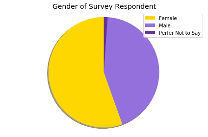

# SheHacks Data Science Deliverables
Given the lack of publicly available data on consumers perception of safety during a pandemic, I created my own survey to distribute to gain some insights. My team and I distributed on our social channels and received 92 respondents. Considering this is a self made survey it has many limitations from the bias in the survey itself to our distribution methods and sample pool.

### Survey Details
The survey is 13 questions long, 2 of which are used to gather age and gender data of the respondent. 
The next questions are on how comfortable the respondent would feel about different health and safety measures while attending an event.
The final 2 questions are optional short responses to capture additional concerns over health and safety and features they would be looking for in an app. 
The survey was conducted on google forms.

 

### Free Response Survey Questions 

There were 45 meaningful responses to the health and safety concerns question and 33 responses on other features you are looking for from a ticketing app question. I did not consider this enough data to find any sentiment analysis tools useful. I've instead found most common themes among the results. 

**Anything else about health and safety at events that concerns you?** 
- Top concern was the distance between seats and maintaining social distance through crowded areas such as the entrances/ exits and the restrooms. 
- The next top concern was the enforcement of masks at the event and other people's behavior. 
- A couple respondents said it was too soon for them to feel comfortable thinking of attending events. 

**Any other features you are looking for from a ticketing/ events app?** 
- The most requested feature was clear outline of the events Health and Safety regulations. One respondent even suggested an agreement page in the app. 
- Contactless or RFDI entrance was another popular request 
- Maps of the venue as well as event schedule was also requested. 
- 2 respondents mentioned social component to the app

### What data can be collected?

Data is collected through out the process, from the initial sign-up, there is the gathering of the consumers address as well as any company affiliation. Once at the event, we know when the guest scans in and out with their ticket. Once more features become live we'll have a payment option which will allow us to track the average amount spent at the events. We've had a lot of great features that we've discussed over the past week, ordering food/beverages and merchandise through the app, all of which ways to gather additional data and insights on the consumer. 

On the admin side, we're able to track the capacity of all areas with both the scan in and out feature but also the consumers geolocation data, you'd be able to track the density of people in different areas. This would be easy to track on any dashboard software. As the features in the app expand the information available in real time would also. 

In regards to what data can be legally collected. That would have to do with the client. CCPA, one of the only active data laws in the country has 3 thresholds that must be met before you're required to comply: the companies total revenue, the number of consumer's data they possess, and how much of their revenue is made selling consumer data.

